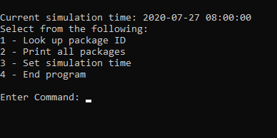
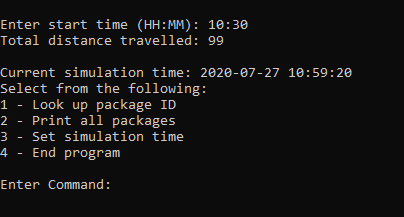
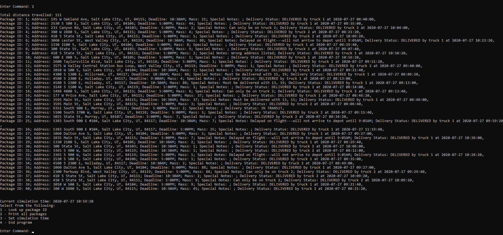

# Delivery Route Finder
### Overview
CLI application written Python that provides a solution to a traveling salesman problem.

### Installation
1. Clone repository
2. Unzip files
3. Open command prompt and navigate to the project directory.
4. Run the "main.py" file.

### Features
* Uses K-Nearest neighbor algorithm and heuristics to efficiently deliver 40
packages to their intended destination while adhering to delivery constraints.
* Implemented custom hash table and graph data structures. Does not use the 
standard library's dictionary function.
* Package and distance table CSV files are included in the utilities folder.

### Project Takeaways
**Divide and Conquer**: Breaking down complex problems into smaller more managable parts and tackling
the smaller problems one by one.   
**Complexity Management**: Utilize OOP techniques to create clear problem abstractions that keep code clean and well 
organized.

### Images
**Main Screen of Application**: 

  
**Setting the simulation time**: 

  
**Displaying package statuses**: 
